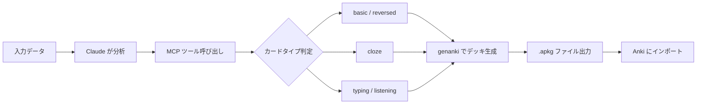
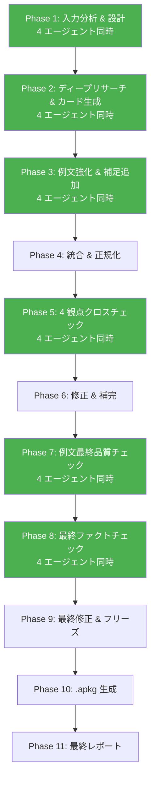

<div align="center">

# Anki MCP Server

### Anki デッキ自動生成 MCP サーバー

[](https://www.python.org/)
[](https://modelcontextprotocol.io/)
[](https://apps.ankiweb.net/)
[](LICENSE)

**任意のデータから高品質な Anki デッキ (.apkg) を自動生成する MCP サーバー**

---

</div>

どんな教科・分野のデータでも、Claude に渡すだけで Anki デッキに変換できます。英語学習向けの TTS 音声付きカードにも対応。

## 特徴

- **5種類のカードタイプ** に対応（用途に応じて最適なカードを自動選択）
- **TTS 音声対応** -- iOS AnkiMobile / PC 版 Anki で英単語を自動読み上げ
- **語彙デッキ一括生成** -- 英単語リストを渡すだけで品詞・語源・例文付きカードを生成
- **穴埋め一括生成** -- 長文から重要語句を穴埋めにしたカードを量産
- **`/anki` スラッシュコマンド** -- Claude Code 上で 11 フェーズの高品質デッキ生成パイプライン（うち 6 フェーズ × 4 並列 = 計 24 サブエージェント起動）

---

## カードタイプ一覧

| タイプ | 説明 | 用途 |
|--------|------|------|
| `basic` | 表 → 裏 | 一般的な Q&A、定義の暗記 |
| `reversed` | 表 → 裏 & 裏 → 表 | 英単語（英→日・日→英の両方向） |
| `cloze` | 穴埋め (`{{c1::答え}}`) | 文脈の中でキーワードを覚える |
| `typing` | タイプ入力 | スペル練習、正確な用語の暗記 |
| `listening` | 音声のみ → 意味を答える | リスニング力強化（TTS 必須） |

すべてのカードタイプで **HTML** (`<b>`, `<i>`, `<br>`, `<table>` 等) が使えます。

---

## 処理フロー



---

## `/anki` コマンドのパイプライン

Claude Code の `/anki` スラッシュコマンドを使うと、以下の 11 フェーズを自動実行します。



> 緑のフェーズは **4 エージェント並列実行**（6 フェーズ × 4 並列 = 計 24 サブエージェントを起動。同時実行ではなくフェーズごとに 4 並列）

---

## インストール

### 1. リポジトリをクローン

```bash
git clone https://github.com/cUDGk/anki-mcp.git
cd anki-mcp
```

### 2. 依存パッケージをインストール

```bash
pip install -r requirements.txt
```

### 3. Claude Code に MCP サーバーとして登録

`~/.claude/settings.json` (グローバル) または `.claude/settings.json` (プロジェクト) に以下を追加:

```json
{
  "mcpServers": {
    "anki-deck-generator": {
      "command": "python",
      "args": ["<install-dir>/server.py"],
      "env": {}
    }
  }
}
```

> `<install-dir>` は `git clone` した anki-mcp ディレクトリの絶対パスに置き換えてください。
> - **Windows**: 例 `C:/Users/<you>/anki-mcp/server.py`（Windows でも JSON 内ではフォワードスラッシュ可）
> - **macOS**: 例 `/Users/<you>/anki-mcp/server.py`
> - **Linux**: 例 `/home/<you>/anki-mcp/server.py`

### 4. `/anki` スラッシュコマンドをセットアップ（任意）

```bash
cp commands/anki.md ~/.claude/commands/anki.md
```

これにより、Claude Code 上で `/anki TOEIC英単語 500語` のように使えるようになります。

---

## 使い方

### MCP ツールとして使う

Claude Code のチャット内で、以下のように自然言語で依頼するだけで MCP ツールが自動的に呼び出されます:

```
「TOEIC頻出英単語50語のAnkiデッキを作って。TTS音声付きで。」
```

```
「高校物理の力学の穴埋めカードを30枚作って」
```

### 利用可能な MCP ツール

| ツール | 説明 |
|--------|------|
| `generate_anki_deck` | カードデータから Anki デッキを生成 |
| `generate_vocab_deck` | 語彙リストから英単語デッキを一括生成 |
| `generate_cloze_from_text` | 穴埋めカードを一括生成 |
| `list_card_types` | カードタイプの一覧と使い方を表示 |
| `merge_anki_decks` | 複数デッキのマージ手順を案内 (実際のファイルマージではなく、Anki アプリ上での手動マージ手順を返す) |

### `/anki` コマンドで使う

```
/anki TOEIC英単語 800点レベル 100語
```

11 フェーズの品質管理パイプラインにより、以下が自動で行われます:

- Web 検索による正確な定義・例文の取得
- 4 観点クロスチェック（ファクト・網羅性・一貫性・学習設計）
- 品詞・語源・例文の自動付与
- TTS 音声・リスニングカードの自動生成

---

## 出力例

生成されたデッキは `ANKI_OUTPUT_DIR`（デフォルト: `~/Desktop`）に `.apkg` ファイルとして保存されます。`ANKI_OUTPUT_DIR` を設定しない場合、Windows では `C:\Users\<you>\Desktop\`、macOS / Linux では `~/Desktop/` がデフォルトです。Anki で「ファイル → インポート」から読み込めます。

### 環境変数

| 変数名 | デフォルト | 説明 |
|--------|-----------|------|
| `ANKI_OUTPUT_DIR` | `~/Desktop` | デッキの出力先ルートディレクトリ。`output_path` を明示した場合もこのディレクトリ配下に限定される |
| `ANKI_CARD_LIMIT` | `5000` | 1 デッキあたりの最大カード枚数。超過すると `ValueError` |
| `ANKI_FIELD_MAX` | `65536` | 1 フィールドあたりの最大文字数。超過したカードはスキップされエラーとして記録される |

```
~/Desktop/TOEIC英単語.apkg
~/Desktop/高校物理_力学.apkg
```

---

## 技術スタック

| コンポーネント | 技術 |
|----------------|------|
| MCP サーバー | [FastMCP](https://github.com/modelcontextprotocol/python-sdk) (Python) |
| デッキ生成 | [genanki](https://github.com/kerrickstaley/genanki) |
| TTS | Anki 内蔵 TTS エンジン (`{{tts en_US speed=1.0:Word}}`) ※ Anki 2.1.20+ が必要 |
| スラッシュコマンド | Claude Code Custom Commands |

---

## Attribution

このプロジェクトは以下のオープンソースプロジェクトの上に構築されています:

- **[genanki](https://github.com/kerrickstaley/genanki)** -- Python で Anki デッキをプログラム的に生成するライブラリ。Kerrick Staley 氏によるプロジェクト。
- **[MCP Python SDK](https://github.com/modelcontextprotocol/python-sdk)** -- Model Context Protocol の公式 Python 実装。Anthropic による [MCP 仕様](https://modelcontextprotocol.io/) に基づく。

---

## ライセンス

[MIT License](LICENSE) -- Copyright (c) 2026 cUDGk
